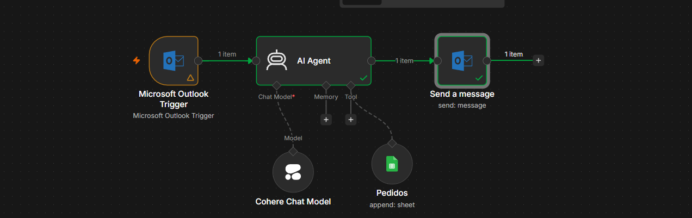

# 🤖 Agente de Automatización de Pedidos — FlexData

Workflow en **n8n** que automatiza la recepción, análisis, registro y respuesta de solicitudes de pedidos que llegan al correo corporativo de **FlexData**, una empresa con varios departamentos (Compras, Ventas, Finanzas, Recursos Humanos).

El flujo recibe el correo de un cliente, lo interpreta con un agente de IA, extrae la información relevante, la registra automáticamente en una hoja de cálculo de Google Sheets propiedad del cliente, y responde al cliente con la información solicitada — todo sin intervención humana.

---

## 📋 Tabla de contenidos

- [Descripción general](#-descripción-general)
- [Arquitectura del flujo](#-arquitectura-del-flujo)
- [Stack tecnológico](#-stack-tecnológico)
- [Estructura del repositorio](#-estructura-del-repositorio)
- [Cómo funciona (paso a paso)](#-cómo-funciona-paso-a-paso)
- [Instalación y configuración](#-instalación-y-configuración)
- [Variables de entorno / credenciales](#-variables-de-entorno--credenciales)
- [Capturas del workflow](#-capturas-del-workflow)
- [Roadmap](#-roadmap)

---

## 📖 Descripción general

Un cliente (por ejemplo `daniel.estudio.alura.2026@gmail.com`) envía un correo solicitando información o realizando un pedido al buzón corporativo de FlexData (`daniel.estudio.alura.2026@outlook.com`). Un agente de IA (**Pablo**, agente de ventas virtual) interpreta la solicitud, identifica el canal de origen, extrae los datos clave del pedido, los guarda en la planilla **"Planilla de Pedidos de FlexData"** en Google Sheets, y responde automáticamente al cliente con la información solicitada en formato HTML.

## 🏗️ Arquitectura del flujo



```
┌──────────────────────────┐
│  1. Recepción de Correo   │  Trigger: Outlook - Message Received
│     Corporativo (Outlook) │  Polling cada 1 minuto
└────────────┬──────────────┘
             │
             ▼
┌──────────────────────────┐
│ 2. Análisis y Extracción  │  Agente de IA (Pablo, vendedor FlexData)
│    Inteligente de         │  Genera respuesta HTML personalizada
│    Solicitudes             │
└────────────┬──────────────┘
             │
             ▼
┌──────────────────────────┐
│ 3. Motor de Comprensión   │  Modelo de lenguaje: Cohere (command-a-03-2025)
│    de Solicitudes          │  Provee el razonamiento al agente
└────────────┬──────────────┘
             │
             ▼
┌──────────────────────────┐
│ 4. Registro de Pedidos     │  Google Sheets → Append Row
│    (Google Sheets)         │  Campos: Fecha, Canal, Cliente,
│                             │  Asunto, Mensaje
└────────────┬──────────────┘
             │
             ▼
┌──────────────────────────┐
│ 5. Respuesta Automática    │  Outlook - Send Message
│    al Cliente               │  Reenvía el HTML generado por el agente
└──────────────────────────┘
```

## 🛠️ Stack tecnológico

| Componente | Herramienta |
|---|---|
| Orquestador de workflow | [n8n](https://n8n.io) |
| Bandeja de entrada corporativa | Microsoft Outlook (trigger de correo) |
| Modelo de lenguaje (LLM) | Cohere `command-a-03-2025` |
| Agente conversacional | AI Agent Node de n8n |
| Almacenamiento de pedidos | Google Sheets |
| Canal de respuesta | Microsoft Outlook (envío de correo) |

## 📁 Estructura del repositorio

```
flexdata-agente-pedidos-n8n/
├── README.md                          # Este archivo
├── LICENSE
├── .gitignore
├── .env.example                       # Plantilla de variables/credenciales necesarias
├── docs/
│   ├── arquitectura.md                # Detalle técnico de cada nodo
│   └── capturas/                      # Capturas de pantalla del workflow en n8n
│       ├── 00-vista-general-workflow.png
│       ├── 01-recepcion-correo-corporativo.png
│       ├── 02-analisis-extraccion-inteligente.png
│       ├── 03-motor-comprension-solicitudes.png
│       ├── 04a-registro-pedidos-sheets.png
│       ├── 04b-registro-pedidos-sheets-mapeo.png
│       └── 05-respuesta-automatica-cliente.png
├── workflows/
│   └── flexdata-pedidos.json          # Export del workflow de n8n (importable)
└── src/
    └── prompts/
        └── agente-ventas-pablo.md     # Prompt/rol del agente de IA
```

## 🔄 Cómo funciona (paso a paso)

1. **Recepción de Correo Corporativo** — Nodo trigger de Outlook que revisa la bandeja cada minuto (`Poll Times: Every Minute`) y se dispara cuando llega un mensaje nuevo (`Message Received`).
2. **Análisis y Extracción Inteligente de Solicitudes** — Un AI Agent Node recibe el asunto, cuerpo y remitente del correo. Actúa como *Pablo*, agente de ventas de FlexData, con la meta de completar la planilla de pedidos y responder al cliente con un tono amable y profesional.
3. **Motor de Comprensión de Solicitudes** — Proporciona el modelo de lenguaje (Cohere `command-a-03-2025`) que impulsa el razonamiento del agente del paso anterior.
4. **Registro de Pedidos** — El agente estructura la información y un nodo de Google Sheets (`Append Row`) guarda: fecha, canal de origen (detectado automáticamente: Gmail, Outlook, LinkedIn, Instagram, WhatsApp, etc.), cliente, asunto y mensaje.
5. **Respuesta Automática al Cliente** — Un nodo de Outlook (`Send`) reenvía al remitente original la respuesta HTML generada por el agente en el paso 2.

## ⚙️ Instalación y configuración

1. Clona este repositorio.
2. En tu instancia de n8n, importa el archivo [`workflows/flexdata-pedidos.json`](workflows/flexdata-pedidos.json).
3. Configura las credenciales necesarias (ver sección siguiente).
4. Ajusta el ID de la planilla de Google Sheets destino en el nodo **Registro de Pedidos**.
5. Activa el workflow.

## 🔐 Variables de entorno / credenciales

Este workflow requiere las siguientes credenciales configuradas en n8n (ver `.env.example` como referencia, **nunca subas credenciales reales al repositorio**):

- Cuenta de Microsoft Outlook (OAuth2) — lectura y envío de correo.
- Cuenta de Cohere (API Key) — modelo de lenguaje.
- Cuenta de Google Sheets (OAuth2) — lectura/escritura en la planilla.

## 🖼️ Capturas del workflow

Ver carpeta [`docs/capturas`](docs/capturas) para el detalle visual de cada nodo.

## 🗺️ Roadmap

- [ ] Agregar clasificación automática por departamento (Compras, Ventas, Finanzas, RR.HH.).
- [ ] Soporte multicanal (WhatsApp, Instagram, LinkedIn) como se menciona en el campo "Canal".
- [ ] Notificaciones internas a Slack/Teams cuando se registra un nuevo pedido.
- [ ] Manejo de adjuntos (`hasAttachments`).

## 📄 Licencia

Este proyecto se distribuye bajo la licencia MIT. Ver [LICENSE](LICENSE).
